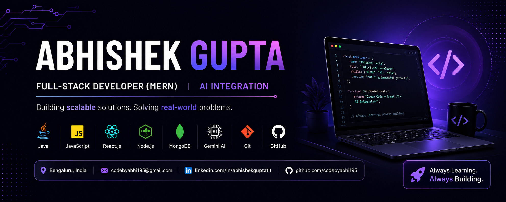

<h1 align="center">Hi 👋, I'm Abhishek Gupta</h1>
<h3 align="center">🚀 Full Stack Developer | MERN | Java | DSA | AI Integration</h3>

  

---

## 🧑‍💻 About Me
- 🎓 B.Tech CSE (2026)
- 💻 MERN Stack Developer
- 🔥 Strong in DSA (Java)
- 🤖 Exploring AI Integration
- 📍 Bangalore, India

---

## ⚡ Tech Stack

  

---

## 🚀 Projects

### 🔹 LibraryStream India
📌 Online library system  
⚙️ HTML, CSS, JS  

### 🔹 Promblem (DSA Practice)
📌 Java-based problem solving  
⚙️ Focus: DSA & logic building  

---

## 📊 GitHub Stats

  
  

---

## 🌐 Connect With Me

  

---

## ⚡ Fun Fact
💡 I build ideas into real-world apps 🚀
